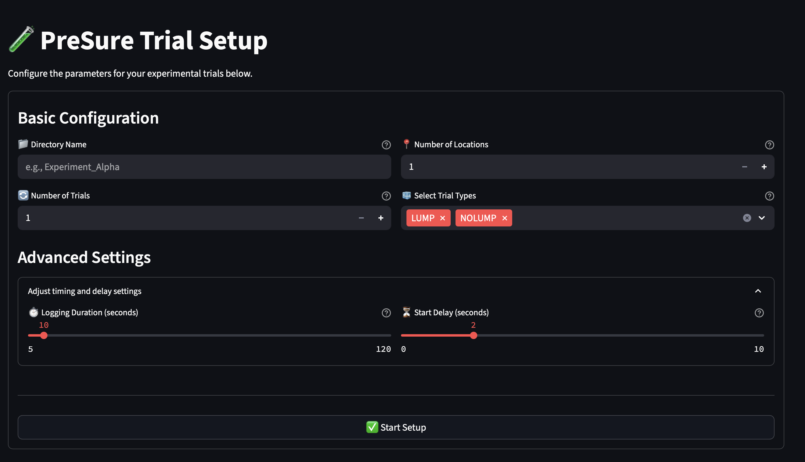

# PreSure: A Streamlined Pressure Sensing Platform

**PreSure** is a robust and user-friendly application designed to facilitate the collection and analysis of pressure sensor data for scientific and research applications. By providing an intuitive interface for trial management and data logging, PreSure empowers researchers to focus on their experiments without the need for extensive technical expertise.

| Setup Page |
| :---: |
|  |

## Key Features

- **Intuitive Web-Based Interface:** Simplifies the process of setting up and executing experimental trials.
- **Automated Data Logging:** Seamlessly records sensor data from a connected Arduino device.
- **Mock Data Simulation:** Enables full application testing and trial simulation without requiring physical hardware.
- **Structured Data Output:** Organizes collected data into a clean, analysis-ready format.

## Getting Started

For comprehensive instructions on installing and operating PreSure, please consult our detailed documentation:

- **[Installation Guide](./docs/installation.md)**
- **[User Manual](./docs/usage.md)**

## Contributing & Support

We welcome contributions and feedback from the community. If you encounter any issues or have suggestions for improvement, please visit our [Issue Tracker](https://github.com/priyanshum17/pressure-ui/issues).

For all other inquiries, please contact us at [pmehta305@gatech.edu](mailto:pmehta305@gatech.edu).

## About This Project

PreSure was developed to streamline the often-complex process of pressure sensor data acquisition. The platform is built on a robust foundation of Python and Streamlit, ensuring both reliability and extensibility for future development.
